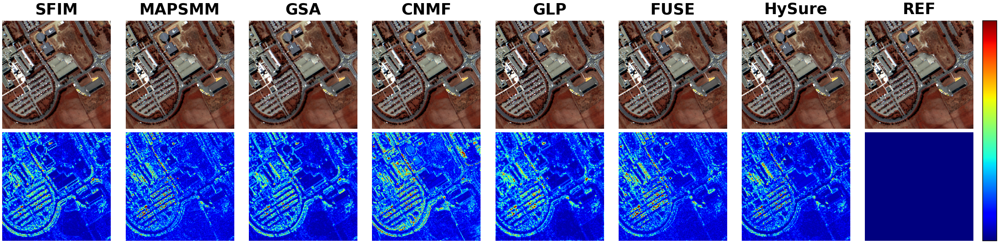

# HyperspectralImageFusion

<p align="center">
  English · <a href="README.zh-CN.md">Chinese</a>
</p>

HyperspectralImageFusion is a Python reproduction toolkit for traditional
hyperspectral image fusion and HSI-MSI fusion methods.

The project is intended for experiments and method comparison. The
methods are reproduced from the corresponding papers and public algorithm
descriptions.

```text
put input .mat files in DATA/INPUT
run hyperspectral_image_fusion.py
get fused .mat results in DATA/OUTPUT
```

## Methods

- `sfim`: smoothing filter-based intensity modulation
- `mapsmm`: MAP estimation with stochastic mixing model
- `gsa`: Gram-Schmidt adaptive fusion
- `cnmf`: coupled nonnegative matrix factorization
- `glp`: MTF-generalized Laplacian pyramid hypersharpening
- `fuse`: fast fusion of multi-band images
- `hysure`: convex subspace-based fusion

Default method settings are selected for stable HSI/MSI fusion experiments.
You can override the shared SFIM/GLP mode setting with `--mode`.

## Comparison



The table below reports the current Python results on the Pavia University
dataset example.

| Method | SAM↓ | PSNR↑ | ERGAS↓ | CC↑ | RMSE↓ | SSIM↑ |
|---|---:|---:|---:|---:|---:|---:|
| SFIM | 2.9939 | 37.76 | 3.4266 | 0.9728 | 0.0261 | 0.9257 |
| MAPSMM | 3.4522 | 38.43 | 3.9386 | 0.9628 | 0.0313 | 0.9260 |
| GSA | 3.1182 | 38.56 | 3.1894 | 0.9769 | 0.0241 | 0.9294 |
| CNMF | 3.8827 | 37.03 | 4.1661 | 0.9596 | 0.0328 | 0.9195 |
| GLP | 3.1788 | 36.29 | 3.3004 | 0.9798 | 0.0226 | 0.9385 |
| FUSE | 3.4954 | 37.56 | 3.8107 | 0.9675 | 0.0291 | 0.9280 |
| HySure | 2.8935 | 38.31 | 3.2831 | 0.9757 | 0.0253 | 0.9454 |

## Reference Papers

- `sfim`: J. G. Liu, "Smoothing Filter-based Intensity Modulation: A Spectral
  Preserve Image Fusion Technique for Improving Spatial Details," International
  Journal of Remote Sensing, 2000.
  [[Paper](https://doi.org/10.1080/014311600750037499)]
- `mapsmm`: M. T. Eismann and R. C. Hardie, "Application of the Stochastic
  Mixing Model to Hyperspectral Resolution Enhancement," IEEE TGRS, 2004.
  [[Paper](https://doi.org/10.1109/TGRS.2004.830644)]
- `gsa`: B. Aiazzi, S. Baronti, and M. Selva, "Improving Component
  Substitution Pansharpening Through Multivariate Regression of MS + Pan Data,"
  IEEE TGRS, 2007.
  [[Paper](https://doi.org/10.1109/TGRS.2007.901007)]
- `cnmf`: N. Yokoya, T. Yairi, and A. Iwasaki, "Coupled Nonnegative Matrix
  Factorization Unmixing for Hyperspectral and Multispectral Data Fusion,"
  IEEE TGRS, 2012.
  [[Paper](https://doi.org/10.1109/TGRS.2011.2161320)]
- `glp`: M. Selva, B. Aiazzi, F. Butera, L. Chiarantini, and S. Baronti,
  "Hypersharpening: A First Approach on SIM-GA Data," IEEE JSTARS, 2015.
  [[Paper](https://doi.org/10.1109/JSTARS.2015.2440092)]
- `fuse`: Q. Wei, N. Dobigeon, and J.-Y. Tourneret, "Fast Fusion of Multi-Band
  Images Based on Solving a Sylvester Equation," IEEE TIP, 2015.
  [[Paper](https://doi.org/10.1109/TIP.2015.2458572)]
- `hysure`: M. Simoes, J. Bioucas-Dias, L. B. Almeida, and J. Chanussot,
  "A Convex Formulation for Hyperspectral Image Superresolution via
  Subspace-Based Regularization," IEEE TGRS, 2015.
  [[Paper](https://doi.org/10.1109/TGRS.2014.2375320)]

If you use this repository for research, please cite the corresponding original
papers.

## Project Structure

```text
HyperspectralImageFusion
├─ DATA
│  ├─ INPUT
│  │  ├─ HR_MSI.mat
│  │  └─ LR_HSI.mat
│  ├─ REF.mat
│  └─ OUTPUT
├─ hyperspectral_image_fusion.py
├─ FUNCTION
│  ├─ common.py
│  ├─ sfim.py
│  ├─ mapsmm.py
│  ├─ gsa.py
│  ├─ cnmf.py
│  ├─ glp.py
│  ├─ fuse.py
│  └─ hysure.py
├─ IMG
│  └─ comparison.png
├─ .docs
│  ├─ README.md
│  └─ README.zh-CN.md
├─ LICENSE
├─ README.md
└─ requirements.txt
```

## Install

```bash
pip install -r requirements.txt
```

## Input Data

Use `.mat` files:

```text
DATA/INPUT/LR_HSI.mat
DATA/INPUT/HR_MSI.mat
```

The repository includes these example HSI/MSI input files so the commands below
can be run directly after installation.

`DATA/REF.mat` is included only as a reference image for optional visual or
metric comparison after fused outputs are generated. It is not required by the
fusion command.

The expected array layout is:

```text
rows x cols x bands
```

If the array is stored as:

```text
bands x rows x cols
```

the script moves the band dimension to the end when the first dimension is the
smallest dimension.

Both regular `.mat` files and v7.3 `.mat` files are supported. If a `.mat` file
contains more than one variable, pass `--hsi-key` and `--msi-key`.

## Usage

Run one method:

```bash
python hyperspectral_image_fusion.py --hsi DATA/INPUT/LR_HSI.mat --hsi-key data --msi DATA/INPUT/HR_MSI.mat --msi-key data --method cnmf
```

Run all methods:

```bash
python hyperspectral_image_fusion.py --hsi DATA/INPUT/LR_HSI.mat --hsi-key data --msi DATA/INPUT/HR_MSI.mat --msi-key data --method all
```

Available method names:

```text
sfim, mapsmm, gsa, cnmf, glp, fuse, hysure
```

Results are saved as:

```text
DATA/OUTPUT/<input_name>_<method>.mat
```

The output variable name is:

```text
data
```

## Python API

```python
from hyperspectral_image_fusion import run_method
from FUNCTION.cnmf import cnmf
from FUNCTION.sfim import sfim

fused_cnmf = cnmf(lr_hsi, hr_msi)
fused_sfim = sfim(lr_hsi, hr_msi)
fused = run_method("mapsmm", lr_hsi, hr_msi)
```

## License

This project is released under the MIT License. See [LICENSE](../LICENSE).
